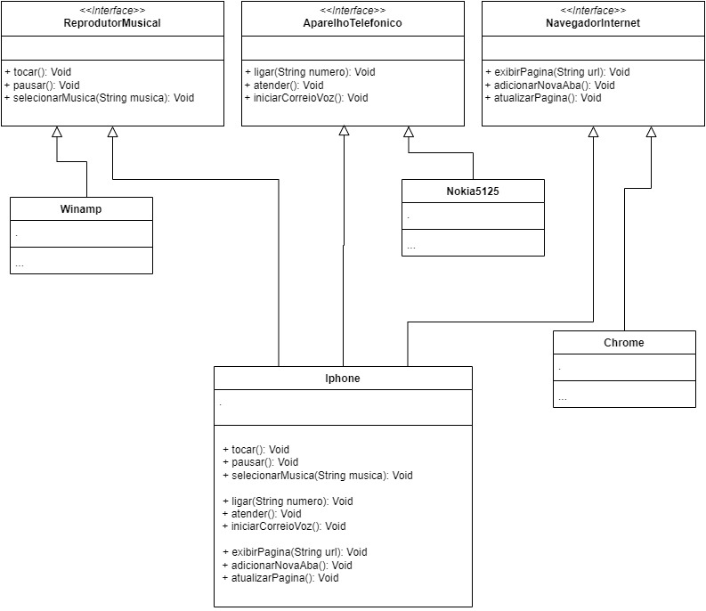

# Desafio de JAVA Básico

## Modelagem e Diagramação de um Componente iPhone
Neste desafio, você será responsável por modelar e diagramar a representação UML do componente iPhone, abrangendo suas funcionalidades como Reprodutor Musical, Aparelho Telefônico e Navegador na Internet.

## Contexto
Com base no vídeo de lançamento do iPhone de 2007, você deve elaborar a diagramação das classes e interfaces utilizando uma ferramenta UML de sua preferência. Em seguida, implemente as classes e interfaces no formato de arquivos .java.

## Funcionalidades a Modelar

**Reprodutor Musical**

Métodos: tocar(), pausar(), selecionarMusica(String musica)

**Aparelho Telefônico**

Métodos: ligar(String numero), atender(), iniciarCorreioVoz()

**Navegador na Internet**

Métodos: exibirPagina(String url), adicionarNovaAba(), atualizarPagina()

## Objetivo

1 - Criar um diagrama UML que represente as funcionalidades descritas acima.

2 - Implementar as classes e interfaces correspondentes em Java (Opcional).

## Objetivo 1 
Utilizando o Draw.io foi gerada a UML abaixo:

